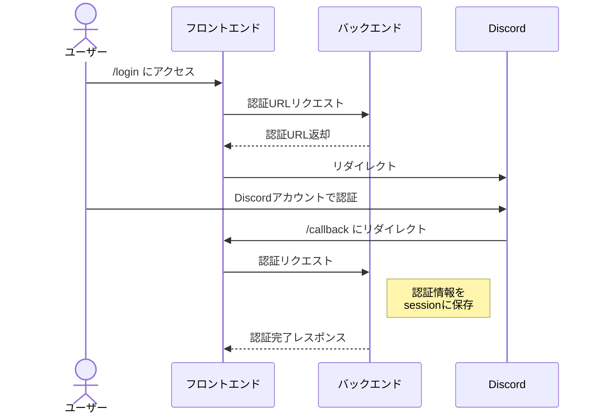

# albot-backend

albot-webからAPI部分を切り分けて、Restfulに再実装します。  
FastAPIを使用します。

# Table of Contents

- [Authentication](#Authentication)
  - [認証方法](#認証方法)
  - [ユーザーの認証フロー](#ユーザーの認証フロー)
- [Endpoints (`/v2`)](#Endpoints-v2)
  - [OAuth2 API](#OAuth2-API)
    - [Login API](#Login-API-oauth2login)
    - [Callback API](#Callback-API-oauth2callback)
    - [Logout API](#Logout-API-oauth2logout)
  - [Shards](#Shards-API-shards)
    - [List API](#List-API-shards)
    - [Assign API](#Assign-API-shardsassign)
    - [Release API](#Release-API-shardsshard_idrelease)
    - [Connection commands API](#Connection-commands-API-shardsshard_idconnection_commands)
    - [Metrics API](#Metrics-API-POST-shardsshard_idmetrics)
  - [Users](#Users-API-users)
    - [Get user info](#Get-user-info-usersmeinfo)
    - [List subscriptions](#list-subscriptions-usersusersubscriptions)
    - [Activate subscription](#Activate-subscription-usersusersubscriptionssubscription_idactivate)
    - [Cancel subscription](#Cancel-subscription-usersusersubscriptionssubscription_idcancel)
    - [Renew subscription](#Renew-subscription-usersusersubscriptionssubscription_idrenew)
    - [List user's guilds](#List-users-guilds-usersmeguilds)
    - [Get user's guild info](#Get-users-guild-info-usersmeguildsguild_idinfo)
    - [Checkout](#Checkout-usersmecheckout-session)
  - [Guilds](#guilds-api-guildsguild_id)
    - [Create resource](#Create-a-resource-guildsguild_id)
    - [Delete resource](#Delete-a-resource-guildsguild_id)
    - [Dict API](#Dict-API-guildsguild_iddict)
    - [Settings API](#Settings-API-guildsguild_idsettings)
    - [Character usage API](#Character-usage-API-guildsguild_idcharacter_usage)
    - [Trusted roles API](#Trusted-roles-API-guildsguild_idtrusted_roles)
    - [Connection states API](#Connection-states-API-guildsguild_idconnection_states)
    - [Message link expand preference API](#Message-link-expand-preference-API-guildsguild_idmessage_link_expand_preference)
    - [Connection command API](#Connection-command-API-guildsguild_idconnection_command)
    - [Subscriptions API](#Subscriptions-API-guildsguild_idsubscriptions)
  - [Metrics API](#Metrics-API-GET-metrics)
  - [Webhooks API](#Webhooks-API)
    - [Stripe Webhook](#Stripe-Webhook-webhooksstripe)

# Authentication
## 認証方法
* 各シャードからの認証には、Bearerトークンを使用します。
```http
Authorization
Bearer <token>
```
## ユーザーの認証フロー



# Endpoints (`/v2`)

## OAuth2 API

### Login API `/oauth2/login`

- `GET` : OAuth2認証のリダイレクトURLを取得します。

__Request Parameters__

- redirect (query): リダイレクト先のURL

__Response__

```json
{
  "message": "Success",
  "data": {
    "url": "https://discord.com/api/oauth2/authorize?..."
  }
}
```

### Callback API `/oauth2/callback`

- `POST` : OAuth2認証のコールバック処理を行います。

__Request Parameters__

- code (query): 認証コード
- state (query): 認証状態

__Response__

```json
{
  "message": "Success"
}
```

### Logout API `/oauth2/logout`

- `POST` : ログアウト処理を行います。

__Response__

```json
{
  "message": "Success"
}
```

## Shards API `/shards/`

### List API `/shards`

- `GET` : シャードの一覧を取得します。

__Request Parameters__

- status (query): シャードのステータス（online, offline, all）、デフォルトは "all"

__Response__

```json
{
  "message": "Success",
  "data": {
    "ids": [
      0,
      1,
      2
    ]
  }
}
```

### Assign API `/shards/assign`
- `GET` : シャードの割当を行い、環境変数を配信します。

__Response__

```json
{
  "message": "Success",
  "data": {
    "shard_count": 10,
    "shard_id": 0,
    "discord_token": "token",
    "sentry_dsn": "dsn",
    "tts_key": "key",
    "heartbeat_token": "token"
  }
}
```

### Release API `/shards/{shard_id}/release`
- `POST` : シャードの終了時に、割当を解除します。

__Response__

```json
{
  "message": "Success"
}
```

### Connection commands API `/shards/{shard_id}/connection_commands`

- `GET` : シャードに接続するサーバーの接続コマンドを取得します。  
  __Options__
  - changes_only (boolean): 前回fetch以降に更新されたコマンドのみ取得します。epoch秒で指定します。
```json
{
  "message": "Success",
  "data": {
    "commands": {
      "123456789012345678": "t.con",
      "234567890123456789": "召喚"
    }
  }
}
```

### Metrics API (POST) `/shards/{shard_id}/metrics`

- `POST` : シャードのメトリクスを更新します。

__Request Body__
```json
{
  "guilds": 10000,
  "connected": 100
}
```

__Response__

```json
{
  "message": "Success"
}
```

## Users API `/users/`

* **/me/**  
  ログイン中のユーザーにアクセス。セッションで認証されます。
* **/{user_id}/**  
  任意のユーザーの情報にアクセス。bearerトークンでの認証が必要です。

### Get user info `/users/me/info`

- `GET`: ログイン中のユーザー情報を取得します。

__Response__

```json
{
  "message": "Success",
  "data": {
    "info": {
      "id": "123456789012345678",
      "username": "username",
      "avatar": "avatar_hash",
      "discriminator": "1234",
      "public_flags": 0,
      "flags": 0,
      "bot": false,
      "system": false,
      "banner": null,
      "accent_color": null,
      "global_name": "Global Name",
      "avatar_decoration_data": null,
      "mfa_enabled": false,
      "locale": "ja",
      "premium_type": null,
      "email": "user@example.com",
      "verified": true
    }
  }
}
```

### List subscriptions `/users/{user}/subscriptions`

- `GET`: ユーザーのサブスクリプションを取得します。

__Response__
```json
{
  "message": "Success",
  "data": {
    "subscriptions": [
      {
        "sub_id": "sub_abcd1234",
        "guild_id": 123456789012345678,
        "plan": "monthly1",
        "sub_start": "2021-01-01T00:00:00",
        "last_updated": "2021-01-01T00:00:00",
        "user_id": 123456789012345678
      }
    ]
  }
}
```

### Activate subscription `/users/{user}/subscriptions/{subscription_id}/activate`

- `POST`: ユーザーのサブスクリプションを有効化します。

__Request Body__
```json
{
  "guild_id": 123456789012345678
}
```

__Response__

```json
{
  "message": "Success"
}
```

### Cancel subscription `/users/{user}/subscriptions/{subscription_id}/cancel`

- `POST`: ユーザーのサブスクリプションをキャンセルします。

__Response__

```json
{
  "message": "Success"
}
```

### Renew subscription `/users/{user}/subscriptions/{subscription_id}/renew`

- `POST`: ユーザーのサブスクリプションを更新します。

__Request Body__
```json
{
  "new_plan": "monthly1"
}
```

__Response__

```json
{
  "message": "Success"
}
```

### List user's guilds `/users/me/guilds`

- `GET`: ユーザーが所属するサーバーの一覧を取得します。

__Request Parameters__

- mutual (query): 相互のサーバーのみを取得するかどうか（デフォルト: true）

__Response__
```json
{
  "message": "Success",
  "data": {
    "guilds": [
      {
        "id": "123456789012345678",
        "name": "サーバー名",
        "icon": "icon_hash",
        "banner": null,
        "owner": true,
        "permissions": "permissions",
        "features": [
          "FEATURE1",
          "FEATURE2"
        ],
        "approximate_member_count": 100,
        "approximate_presence_count": 50
      }
    ]
  }
}
```

### Get user's guild info `/users/me/guilds/{guild_id}/info`

- `GET`: ユーザーが所属するサーバーの情報を取得します。

__Response__
```json
{
  "message": "Success",
  "data": {
    "info": {
      "id": "123456789012345678",
      "name": "サーバー名",
      "icon": "icon_hash",
      "banner": null,
      "owner": true,
      "permissions": "permissions",
      "features": [
        "FEATURE1",
        "FEATURE2"
      ],
      "approximate_member_count": 100,
      "approximate_presence_count": 50
    }
  }
}
```

### Checkout `/users/me/checkout-session`

- `POST`: ユーザーのチェックアウトセッションを作成します。

__Request Body__

```json
{
  "plan": "monthly1"
}
```

__Response__
```json
{
  "message": "Success",
  "data": {
    "url": "https://example.com/"
  }
}
```

## Guilds API `/guilds/{guild_id}/`

### Create a resource `/guilds/{guild_id}`

- `POST` : サーバーのリソースを作成します。

__Response__

```json
{
  "message": "Success"
}
```

### Delete a resource `/guilds/{guild_id}`

- `DELETE` : サーバーのリソースを削除します。

__Response__

```json
{
  "message": "Success"
}
```

### Dict API `/guilds/{guild_id}/dict`
- `GET` : 辞書の一覧を取得します。

__Response__

```json
{
  "message": "Success",
  "data": {
    "dict": {
      "key1": "value1",
      "key2": "value2"
    }
  }
}
```

- `PUT` : 辞書をリクエストデータで置き換えます。

__Request Body__
```json
{
  "dict": {
    "key1": "value1",
    "key2": "value2"
  }
}
```

__Response__

```json
{
  "message": "Success"
}
```

- `DELETE` : 辞書を削除します。

__Response__

```json
{
  "message": "Success"
}
```

### Settings API `/guilds/{guild_id}/settings`
- `GET` : サーバーの読み上げ設定を取得します。

__Response__
```json
{
  "message": "Success",
  "data": {
    "settings": {
      "guild_id": 731467468341510184,
      "lang": "ja-JP",
      "character_limit": 3000,
      "speech_speed": 1.75,
      "read_name": false,
      "custom_voice": null,
      "translate": false,
      "read_name_on_join": true,
      "read_name_on_leave": true,
      "read_guild": false,
      "read_not_joined_users": true,
      "audio_api": "gtts"
    }
  }
}
```
- `DELETE` : サーバーの読み上げ設定を削除します。(初期化)

__Response__

```json
{
  "message": "Success"
}
```

- `POST` : サーバーの読み上げ設定を編集します。

__Request Body__
```json
{ 
  "speech_speed": 1.0,
  "read_name": true
}
```

__Response__

```json
{
  "message": "Success"
}
```

### Character usage API `/guilds/{guild_id}/character_usage`
- `GET` : サーバーの文字数使用状況を取得します。

__Response__
```json
{
  "message": "Success",
  "data": {
    "wavenet": {
      "monthly_quota": 1000000,
      "used_characters": 250000
    },
    "standard": {
      "monthly_quota": 500000,
      "used_characters": 150000
    }
  }
}
```
- `POST` : サーバーの文字数使用状況を更新します。文字数が増えた場合のみUPDATEします。

__Request Body__
```json
{
  "wavenet": {
    "used_characters": 25000
  },
  "standard": {
    "used_characters": 15000
  }
}
```

__Response__

```json
{
  "message": "Success"
}
```

### Trusted roles API `/guilds/{guild_id}/trusted_roles`
- `GET` : サーバーの設定を編集できるロールの一覧を取得します。

__Response__
```json
{
  "message": "Success",
  "data": {
    "enabled": true,
    "role_ids": [
      123456789012345678,
      234567890123456789
    ]
  }
}
```
- `PUT` : サーバーの設定を編集できるロールの一覧を更新します。

__Request Body__
```json
{
  "enabled": true,
  "role_ids": [
    123456789012345678,
    234567890123456789
  ]
}
```

__Response__

```json
{
  "message": "Success"
}
```

### Connection states API `/guilds/{guild_id}/connection_states`
- `POST`: サーバーのConnectionStateを生成して返却します。  
payloadとして、接続コマンドで指定されたオプションを受け取ります。  
BotクライアントのConnectionStateクラスに準拠したオブジェクトを返却します。

__Request Body__
```json
{
  "options": {
    "vc_id": 123456789012345678,
    "tc_id": 234567890123456789,
    "read_guild": false,
    "speech_speed": 1,
    "lang": "jp",
    "read_name": true
  }
}
```

__Response__

```json
{
  "message": "Success",
  "data": {
    "connection_states": {
      "guild_id": 123456789012345678,
      "vc_id": 123456789012345678,
      "target_id": 234567890123456789,
      "service": "gtts",
      "language_code": "ja-JP",
      "translate": false,
      "wavenet_voice": "ja-JP-Standard-A",
      "standard_voice": "ja-JP-Standard-A",
      "custom_voice": null,
      "read_name": true,
      "dict": {},
      "dict_keys": [],
      "speech_speed": 1.0,
      "character_limit": 3000,
      "character_usage": {
        "wavenet": {
          "monthly_quota": 1000000,
          "used_characters": 0
        },
        "standard": {
          "monthly_quota": 500000,
          "used_characters": 0
        }
      },
      "read_guild": false,
      "read_name_on_join": true,
      "read_name_on_leave": true,
      "read_not_joined_users": true,
      "unix_time_connected": 1741740034.4376345,
      "sync_count": 0
    }
  }
}
```

### Message link expand preference API `/guilds/{guild_id}/message_link_expand_preference`
- `GET`: サーバーのメッセージリンク展開設定を取得します。

__Response__
```json
{
  "message": "Success",
  "data": {
    "enabled": true
  }
}
```

- `POST`: サーバーのメッセージリンク展開設定を更新します。

__Request Body__
```json
{
  "enabled": true
}
```

__Response__

```json
{
  "message": "Success"
}
```

### Connection command API `/guilds/{guild_id}/connection_command`
- `GET`: サーバーの接続コマンドを取得します。

__Response__
```json
{
  "message": "Success",
  "data": {
    "command": "召喚"
  }
}
```

- `PUT`: サーバーの接続コマンドを更新します。

__Request Body__
```json
{
  "command": "召喚"
}
```

__Response__

```json
{
  "message": "Success"
}
```

### Subscriptions API `/guilds/{guild_id}/subscriptions`

- `GET`: サーバーのサブスクリプションを取得します。

__Response__
```json
{
  "message": "Success",
  "data": {
    "subscriptions": [
      {
        "sub_id": "sub_abcd1234",
        "guild_id": 123456789012345678,
        "plan": "monthly1",
        "sub_start": "2021-01-01",
        "last_updated": "2021-01-01",
        "user_id": 123456789012345678
      }
    ]
  }
}
```

## Metrics API (GET) `/metrics`
- `GET` : メトリクスを取得します。

__Response__
```json
{
  "message": "Success",
  "data": {
    "metrics": {
      "guilds": 10000,
      "connected": 100
    }
  }
}
```

## Webhooks API

### Stripe Webhook `/webhooks/stripe`

- `POST` : Stripeからのwebhookを処理します。

__Response__

```json
{
  "message": "Success"
}
```